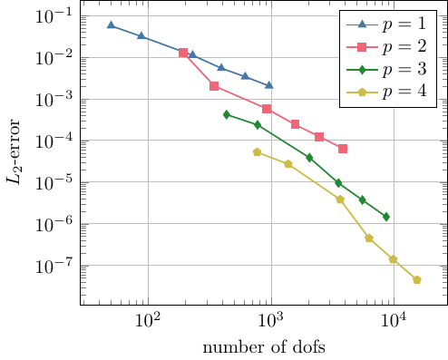
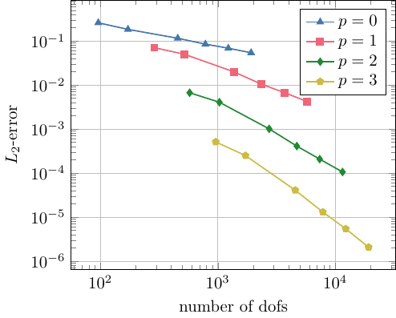
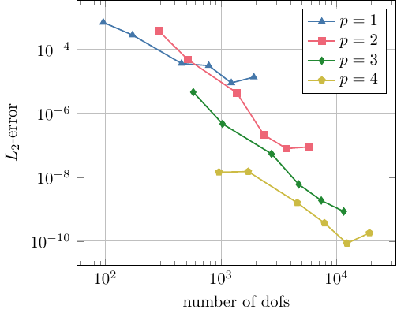

# Convergence Rates for HO BEM 

NG-BEM implements high order boundary element methods. The accuracy of the method depends on the order of the ansatz space and on this page you'll find numerical results of NG-BEM which 

1) verify theoretic results on convergence rates for high order BEM for the following trace spaces, namely, 

$$ H^{\frac12}(\Gamma), \quad H^{-\frac12}(\mathrm{div}_\Gamma, \Gamma) \quad \textnormal{and} \quad H^{-\frac12}(\Gamma)\,.$$

2) verify the high accuracy of the pde solution which is given by a boundary integral representation formula and traces are computed by high order BEM. 

In order to compute the true error of the numerical data, we solve problems whose analytical solution is known.  

**Traces in $H^{\frac12}(\Gamma)$** 

Let us consider the harmonic function $u$ with  

$$ u: \boldsymbol x \mapsto \dfrac{1}{\| \boldsymbol x - \boldsymbol x_s\|}, \quad \boldsymbol x_s = (1,1,1)^\intercal \in \Omega^c\,.  \quad \quad\quad (1) $$ 

Thus, given a domain $\Omega\subset \mathbb R^3$ with Lipschitz boundary $\Gamma$, $u$ is solves the interior boundary value problem

|  |  |  |
| -|--|- |
|$\begin{array}{rcl l} \Delta u &=& 0, \quad  & \mathrm{in} \, \Omega\,, \\ \gamma_1 u &=& u_1, \quad & \mathrm{on} \, \Gamma\,. \end{array}$    | $\quad\quad\quad$  |   |

In our test setting, $\Omega$ is the unit ball and $\Gamma$ the unit sphere, respectively. Using the NG-BEM solver we can compute the Dirichlet data $u_0$ for any order of approximation $p>0$. The following diagram shows the increase of $L_2$ error with respect to uniform $h$ refinemen for fixed order $p$:       

 

For approximation order $p$ in $H^{\frac12}(\Gamma)$ unknown we get a convergence order of $(p+1)/2$.  

**Traces in $H^{-\frac12}(\Gamma)$** 

The harmonic function from (1) also solves the interior boundary value problem with given Dirichlet trace on $\Gamma$, i.e., 

|  |  |  |
| -|--|- |
|$\begin{array}{rcl l} \Delta u &=& 0, \quad  & \mathrm{in} \, \Omega\,, \\ \gamma_0 u &=& u_0, \quad & \mathrm{on} \, \Gamma\,. \end{array}$    | $\quad\quad\quad$  |   |

Using the NG-BEM solver we can compute the Neumann data $u_1$ for any order of approximation $p\geq 0$. The following diagram shows the increase of $L_2$ error with respect to uniform $h$ refinement for fixed order $p$:       

 

For approximation order $p$ in $H^{-\frac12}(\Gamma)$ unknown we get a convergence order of $p/2$.  

**Solution in $H^{1}(\Omega)$** 

We actually get the solution of $u$ of the boundary value problem (1) by evaluating the representation formula 

$$u(x) = \int\limits_{\Gamma} G(x-y)\,u_1(y) \, \mathrm{d}\sigma_y - \int\limits_{\Gamma} \langle n(y), \nabla_y G(x-y) \rangle \, u_0(y) \, \mathrm{d} \sigma_y\,.$$

We consider $u$ on a rectangular screen placed inside the unit ball and compute the $L_2$-error for fixed order $p$ in Neumann and Dirichlet trace. The $h$-version of this test is summarized in the following diagram: 

 

**Notes:** 

* The geometrical approximation order is $1$ for the test runs with manufactured solution $u$. There is no need to consider curved meshes to obtain these convergence rates as $u$ is a solution for all meshes. 
* The presented results we actually considered the Laplace operator with mixed boundary values and solved the bvp only once.
* Check out the repository's test folder to find the test setting and an exemplary test run.

**Trace in $H^{-\frac12}(\mathrm{div}_\Gamma, \Gamma)$** 

 
